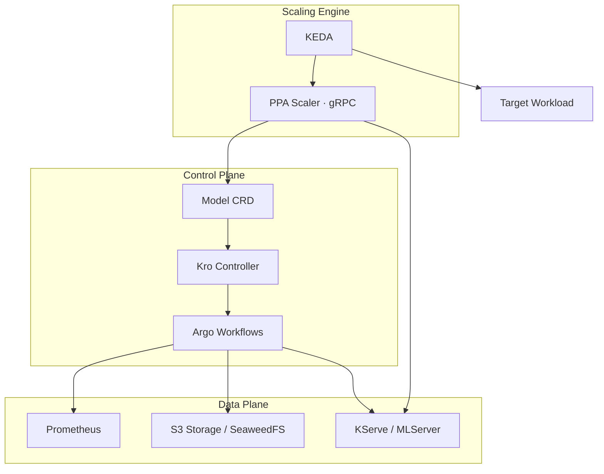

<div align="center">

<h1>Predictive Pod Autoscaler</h1>

<p><strong>AI-driven, proactive horizontal pod autoscaling for Kubernetes</strong></p>

<p>
  <br/>
  
  
  
  
</p>

<p>
  <a href="#-overview">Overview</a> •
  <a href="#-architecture">Architecture</a> •
  <a href="#-prerequisites">Prerequisites</a> •
  <a href="#-installation">Installation</a> •
  <a href="#-usage">Usage</a> •
  <a href="#-configuration">Configuration</a> •
  <a href="#-contributing">Contributing</a> •
  <a href="#-license">License</a>
</p>

</div>

---

## Overview

**Predictive Pod Autoscaler (PPA)** is an AI-driven horizontal pod autoscaling solution for Kubernetes. It uses [Meta's Prophet](https://facebook.github.io/prophet/) time-series forecasting library to **proactively** scale your workloads based on historical CPU and memory usage patterns — before load hits, not after.

### The Problem with Reactive Scaling

Standard Kubernetes HPA and KEDA scalers are **reactive**: they trigger scale-out only after a configured threshold is exceeded. This introduces an unavoidable lag window between demand increase and capacity availability. In latency-sensitive or bursty workloads, this lag directly causes service degradation.

```
Reactive:   Load spikes ──► threshold breached ──► scale-out begins ──► pods ready  (too late)
Proactive:  Load predicted ──► scale-out begins ──► pods ready ──► load spikes       (on time)
```

PPA solves this by continuously learning from historical Prometheus metrics and issuing scale decisions ahead of anticipated demand.

### Key Features

| Feature | Description |
|---|---|
| **Predictive Scaling** | Prophet-based time-series forecasting for proactive replica management |
| **KEDA Integration** | Implements the KEDA External Scaler gRPC protocol — composable with other KEDA scalers |
| **Automated Retraining** | Argo CronWorkflow retrains models hourly, adapting to evolving traffic patterns |
| **Cloud-Native Stack** | Built on KServe, MLServer, and Argo Workflows — production-grade ML infrastructure |
| **Declarative API** | A single `Model` Custom Resource manages the complete autoscaling lifecycle |
| **Multi-Metric Support** | Independently forecast CPU and memory per workload |

---

## Architecture

PPA is a modular, cloud-native system divided into three logical planes.



### Components

#### `Model` Custom Resource Definition
The `Model` CRD is the primary user-facing API. Managed by the [Kro](https://kro.run) controller, applying a `Model` resource triggers the full autoscaling lifecycle automatically:
- **Bootstrap** — an Argo Workflow trains the first Prophet model on historical Prometheus data
- **Continuous Learning** — a `CronWorkflow` handles hourly retraining
- **Serving** — a KServe `InferenceService` is provisioned to expose predictions via gRPC

#### PPA Scaler
A high-performance gRPC service implementing the [KEDA External Scaler](https://keda.sh/docs/latest/concepts/external-scalers/) interface.

| gRPC Method | Behavior |
|---|---|
| `IsActive` | Returns `true` if predicted value > 0. Defaults to `true` on inference failure (safe fallback — never accidentally scales to zero) |
| `GetMetricSpec` | Declares metric name and target utilization to KEDA |
| `GetMetrics` | Queries KServe, returns predicted resource value as the current metric |

#### PPA Pipeline (Training)
A containerized Python application running the end-to-end ML training cycle on each Argo Workflow execution:

1. **Data Ingestion** — resolves pod names from the workload selector and queries Prometheus for the last 60 minutes of container metrics
2. **Model Training** — fits a Prophet model to the collected time-series data
3. **Persistence** — serializes the model as JSON and uploads it to S3-compatible storage

#### PPA Runtime (Inference)
A custom [MLServer](https://mlserver.readthedocs.io/) runtime that loads Prophet-serialized models and serves real-time forecasts. Accepts a `horizon` parameter (minutes to look ahead) and returns the predicted `yhat` value at the end of that horizon.

### Data Flow

```
1. User applies a Model CRD
2. Kro reconciles → triggers initial Argo Workflow
3. Pipeline queries Prometheus (last 60 min of container metrics)
4. Prophet is trained → artifact uploaded to S3
5. KServe provisions InferenceService via PPA Runtime
6. CronWorkflow repeats steps 3–5 every hour
7. KEDA polls PPA Scaler at each scaling interval
8. Scaler reads Model CRD status → discovers InferenceService URL
9. gRPC inference call returns predicted metric value for configured horizon
10. KEDA adjusts Deployment replica count
```

---

## Prerequisites

Ensure your Kubernetes cluster meets the following requirements before deploying PPA.

| Dependency | Min Version | Required | Notes |
|---|---|---|---|
| Kubernetes | 1.25 | Required | Cluster access with sufficient RBAC |
| Helm | 3.x | Required | For chart installation |
| KEDA | 2.19 | Required | Provides the External Scaler framework |
| Argo Workflows | 1.0 | Required | Training pipeline execution |
| KServe | — | Required | Model serving layer |
| Kro | — | Required | `Model` CRD reconciliation |
| Prometheus | — | Required | Metrics source for training data |
| S3-Compatible Storage | — | Required | SeaweedFS, MinIO, or AWS S3 |
| SeaweedFS | 3.52 | Optional | Can be installed by the chart |

> [!TIP]
> If KEDA, Argo Workflows, or SeaweedFS are not yet present in your cluster, the PPA Helm chart can install them automatically. See the [Quick Install](#quick-install--bundle-optional-dependencies) section below.

---

## Installation

PPA is distributed as an OCI Helm chart hosted on the GitHub Container Registry (GHCR).

### Step 1 — Configure Storage

PPA requires S3-compatible object storage to persist trained model artifacts. Create a `values.yaml` with your storage credentials:

```yaml
# values.yaml
s3:
  endpoint: s3.your-domain.com
  bucket: ppa-models
  accessKey: YOUR_ACCESS_KEY
  secretKey: YOUR_SECRET_KEY
  insecure: false
```

### Step 2 — Deploy PPA

```bash
kubectl create namespace ppa

helm install ppa \
  oci://ghcr.io/mehdirtal/predictive-pod-autoscaler/ppa \
  --version 0.1.11 \
  -n ppa \
  -f values.yaml
```

#### Quick Install — Bundle Optional Dependencies

If KEDA, Argo Workflows, or SeaweedFS are not yet present in your cluster:

```bash
helm install ppa \
  oci://ghcr.io/mehdirtal/predictive-pod-autoscaler/ppa \
  --version 0.1.11 \
  --set keda.enabled=true \
  --set argo-workflows.enabled=true \
  --set seaweedfs.enabled=true
```

### Step 3 — Verify Deployment

```bash
# Scaler pod should be Running
kubectl get pods -l app.kubernetes.io/name=ppa-scaler -n ppa

# Model CRD should be registered
kubectl get resourcegraphdefinitions
```

### Upgrading

```bash
helm upgrade ppa \
  oci://ghcr.io/mehdirtal/predictive-pod-autoscaler/ppa \
  --version <NEW_VERSION> \
  -n ppa \
  -f values.yaml
```

### Uninstalling

```bash
helm uninstall ppa -n ppa
```

> [!WARNING]
> If `seaweedfs.enabled=true` was set during install, uninstalling the chart will also remove SeaweedFS and all stored model artifacts. Back up your models before uninstalling if you need to preserve training state.

---

## Usage

Once PPA is installed, enabling predictive autoscaling for an application requires two resources: a `Model` CRD and a KEDA `ScaledObject`.

### Step 1 — Define a Predictive Model

The `Model` CRD tells PPA which workload to monitor, which Prometheus instance to query, and which metric to forecast.

```yaml
apiVersion: ppa.io/v1alpha1
kind: Model
metadata:
  name: my-app-cpu-prediction
  namespace: my-apps
spec:
  prometheusUrl: "http://prometheus-operated.monitoring:9090"
  queryType: "cpu"       # cpu | memory
  workload:
    type: "deployment"   # deployment | statefulset | replicaset | daemonset
    name: "my-app"
```

After applying this resource (`kubectl apply -f model.yaml`), the following happens automatically:

1. Kro detects the new `Model` and reconciles it
2. An Argo Workflow is submitted to train the initial Prophet model
3. A `CronWorkflow` is created to retrain the model hourly
4. A KServe `InferenceService` is deployed to serve predictions

#### `Model` Spec Reference

| Field | Type | Required | Description |
|---|---|---|---|
| `spec.prometheusUrl` | `string` | ✅ | Full URL of the Prometheus instance containing container metrics |
| `spec.queryType` | `string` | ✅ | Metric to forecast: `cpu` or `memory` |
| `spec.workload.type` | `string` | ✅ | Workload kind: `deployment`, `statefulset`, `replicaset`, or `daemonset` |
| `spec.workload.name` | `string` | ✅ | Name of the target Kubernetes workload |

### Step 2 — Configure a KEDA ScaledObject

Link your workload to the PPA External Scaler:

```yaml
apiVersion: keda.sh/v1alpha1
kind: ScaledObject
metadata:
  name: my-app-scaler
  namespace: my-apps
spec:
  scaleTargetRef:
    name: my-app
  minReplicaCount: 1
  maxReplicaCount: 10
  triggers:
    - type: external-push
      metadata:
        scalerAddress: ppa-scaler.ppa:9090
        modelName: my-app-cpu-prediction
        horizon: "5"       # Minutes to look ahead
        targetValue: "0.8" # Target utilization (0.8 = 80%)
```

#### ScaledObject Trigger Parameters

| Parameter | Type | Required | Description |
|---|---|---|---|
| `scalerAddress` | `string` | ✅ | gRPC address of the PPA Scaler. Default: `ppa-scaler.ppa:9090` |
| `modelName` | `string` | ✅ | Must match `metadata.name` of the `Model` CRD in the same namespace |
| `horizon` | `integer` | ✅ | How many minutes into the future to forecast. Smaller = tighter; larger = more lead time |
| `targetValue` | `float` | ✅ | Target utilization ratio (e.g. `0.8` = 80%). Used to compute required replica count |

### Step 3 — Monitor Your Models

```bash
# List training workflows
argo list -n my-apps

# Watch workflow progress in real-time
argo watch <workflow-name> -n my-apps

# Check Model CRD status and InferenceService URL
kubectl get model my-app-cpu-prediction -n my-apps -o yaml

# Check the KServe InferenceService
kubectl get inferenceservice -n my-apps

# Check the KEDA ScaledObject status
kubectl get scaledobject my-app-scaler -n my-apps
```

### Multi-Metric Scaling

You can create multiple `Model` resources and combine multiple triggers in a single `ScaledObject`. KEDA will use the highest predicted replica count across all triggers:

```yaml
triggers:
  - type: external-push
    metadata:
      scalerAddress: ppa-scaler.ppa:9090
      modelName: my-app-cpu-prediction
      horizon: "5"
      targetValue: "0.8"
  - type: external-push
    metadata:
      scalerAddress: ppa-scaler.ppa:9090
      modelName: my-app-memory-prediction
      horizon: "5"
      targetValue: "0.75"
```

---

## Configuration

Full Helm chart configuration reference.

### Scaler

| Key | Default | Description |
|---|---|---|
| `scaler.enabled` | `true` | Deploy the PPA Scaler component |
| `scaler.replicas` | `1` | Number of scaler pod replicas |
| `scaler.image.repository` | `ghcr.io/mehdirtal/predictive-pod-autoscaler/scaler` | Container image |
| `scaler.image.tag` | `latest` | Image tag |
| `scaler.image.pullPolicy` | `IfNotPresent` | Image pull policy |
| `scaler.service.type` | `ClusterIP` | Kubernetes Service type |
| `scaler.service.port` | `9090` | gRPC service port |
| `scaler.resources.requests.cpu` | `250m` | CPU request |
| `scaler.resources.requests.memory` | `256Mi` | Memory request |
| `scaler.resources.limits.cpu` | `500m` | CPU limit |
| `scaler.resources.limits.memory` | `512Mi` | Memory limit |
| `scaler.securityContext.runAsNonRoot` | `true` | Enforce non-root execution |
| `scaler.securityContext.runAsUser` | `1000` | UID for the container process |
| `scaler.securityContext.allowPrivilegeEscalation` | `false` | Disallow privilege escalation |

### Pipeline

| Key | Default | Description |
|---|---|---|
| `pipeline.image.repository` | `ghcr.io/mehdirtal/predictive-pod-autoscaler/pipeline` | Training pipeline image |
| `pipeline.image.tag` | `latest` | Image tag |
| `pipeline.image.pullPolicy` | `IfNotPresent` | Image pull policy |

### Runtime

| Key | Default | Description |
|---|---|---|
| `runtime.image.repository` | `ghcr.io/mehdirtal/predictive-pod-autoscaler/runtime` | Inference runtime image |
| `runtime.image.tag` | `latest` | Image tag |
| `runtime.resources.requests.cpu` | `1` | CPU request — Prophet inference is CPU-intensive |
| `runtime.resources.requests.memory` | `2Gi` | Memory request — Prophet models can be large |
| `runtime.resources.limits.cpu` | `1` | CPU limit |
| `runtime.resources.limits.memory` | `2Gi` | Memory limit |

### S3 Storage

| Key | Default | Description |
|---|---|---|
| `s3.endpoint` | `seaweedfs-s3.seaweedfs:8333` | S3-compatible storage endpoint |
| `s3.bucket` | `ppa` | Bucket name for model artifacts |
| `s3.accessKey` | `admin` | S3 access key — **override in production** |
| `s3.secretKey` | `admin123` | S3 secret key — **override in production** |
| `s3.insecure` | `true` | Disable TLS — **set `false` in production** |

### Optional Dependencies

| Key | Default | Description |
|---|---|---|
| `keda.enabled` | `false` | Install KEDA as a chart dependency |
| `argo-workflows.enabled` | `false` | Install Argo Workflows as a chart dependency |
| `seaweedfs.enabled` | `false` | Install SeaweedFS as a chart dependency |

---

## Security

When deploying PPA in a production environment, review the following:

**S3 Credentials** — The default chart values use placeholder credentials (`admin` / `admin123`). These must be replaced before any production deployment. Use Kubernetes Secrets or an external secrets manager (e.g., External Secrets Operator, HashiCorp Vault).

**TLS for S3** — Set `s3.insecure: false` and configure a valid TLS certificate on your S3 endpoint.

**Pod Security** — The PPA Scaler runs with a hardened security context by default: non-root execution, all Linux capabilities dropped, privilege escalation disabled, and `seccompProfile: RuntimeDefault`. These settings comply with the Kubernetes [Restricted Pod Security Standards](https://kubernetes.io/docs/concepts/security/pod-security-standards/).

**RBAC** — The Scaler holds a `ClusterRole` with full access to `models.ppa.io` resources. The Pipeline holds a `ClusterRole` with read access to workload resources (`deployments`, `statefulsets`, `pods`) and full access to `workflows` and `inferenceservices`. Review and restrict namespace scope if your cluster enforces namespace isolation policies.

---

## Troubleshooting

### Model never becomes `Ready`

- Verify Argo Workflows is running: `kubectl get pods -n argo`
- Check training workflow logs: `argo list -n <namespace>` → `argo logs <workflow-name>`
- Confirm Prometheus is reachable from within the cluster using `spec.prometheusUrl`
- Verify S3 bucket exists and credentials are correct
- Check that KServe controller is healthy: `kubectl get pods -n kserve`

### KEDA reports no metrics from external scaler

- Confirm the PPA Scaler pod is running: `kubectl get pods -n ppa`
- Verify `scalerAddress` matches the service name and port (`ppa-scaler.ppa:9090`)
- Check that `modelName` exactly matches the `Model` CRD name (case-sensitive)
- Confirm the `Model` resource has a `Ready=True` condition in its status
- Review scaler logs: `kubectl logs -l app.kubernetes.io/name=ppa-scaler -n ppa`

### Predictions are consistently off

- The model trains on the **last 60 minutes** of data by default. If your workload has longer periodic patterns (e.g., daily cycles), this window may not capture enough signal.
- Tune the `horizon` parameter — smaller values give more responsive predictions; larger values provide more lead time.
- Tune `targetValue` to match your actual workload resource characteristics.

### High memory usage in the Runtime pod

Prophet models require significant memory during training and inference. If the Runtime pod is OOM-killed, increase `runtime.resources.limits.memory` in your `values.yaml` beyond the default `2Gi`.

---
---

## License

This project is licensed under the **GNU Affero General Public License v3.0 (AGPLv3)**.

> [!IMPORTANT]
> Any software that uses, modifies, or builds upon this project — including network-accessible services — must also be released under AGPLv3 with full source code available.

See the [LICENSE](LICENSE) file for full terms, or read the summary at [choosealicense.com/licenses/agpl-3.0](https://choosealicense.com/licenses/agpl-3.0/).

**Copyright (C) 2025 Mehdi Rtal**

---

<div align="center">
  <sub>Built with ❤️ by <a href="https://github.com/MehdiRtal">Mehdi Rtal</a></sub>
</div>
