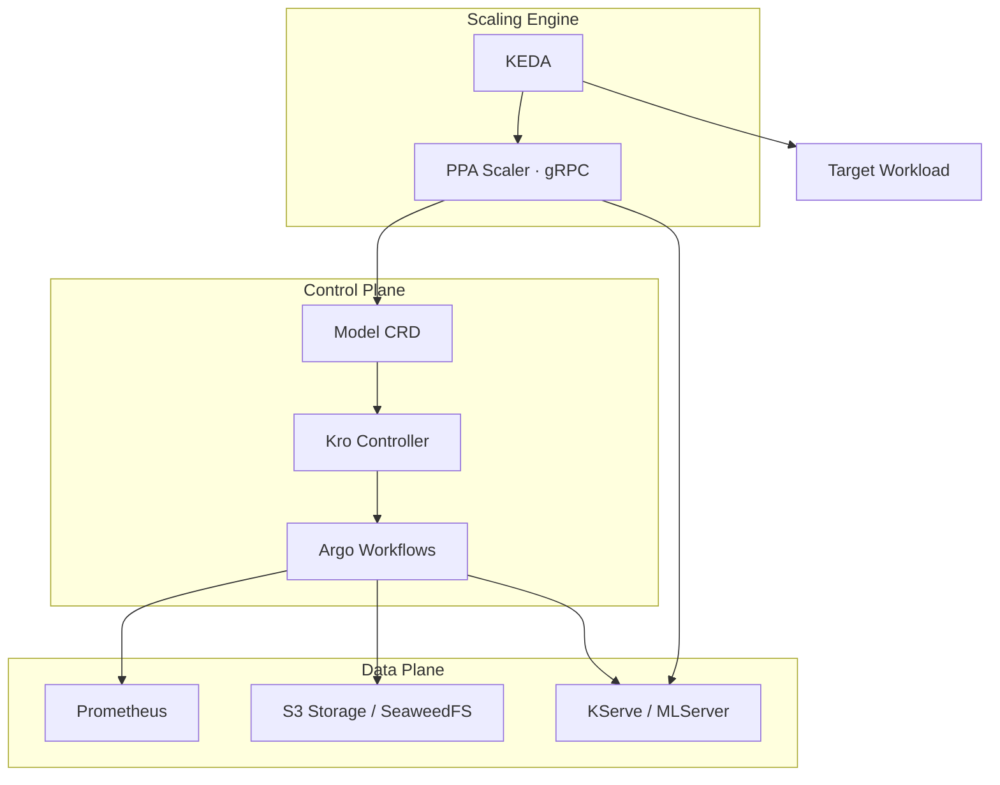

<div align="center">

<h1>Predictive Pod Autoscaler</h1>

<p><strong>AI-driven, proactive horizontal pod autoscaling for Kubernetes</strong></p>

<p>
  <br/>
  
  
  
  
</p>

<p>
  <a href="#-overview">Overview</a> •
  <a href="#-architecture">Architecture</a> •
  <a href="#-quick-start">Quick Start</a> •
  <a href="https://mehdirtal.github.io/predictive-pod-autoscaler">Documentation</a> •
  <a href="#-license">License</a>
</p>

</div>

---

## Overview

**Predictive Pod Autoscaler (PPA)** is an AI-driven horizontal pod autoscaling solution for Kubernetes. It uses [Meta's Prophet](https://facebook.github.io/prophet/) time-series forecasting library to **proactively** scale your workloads based on historical metrics — before load hits, not after.

```
Reactive:   Load spikes ──► threshold breached ──► scale-out begins ──► pods ready  (too late)
Proactive:  Load predicted ──► scale-out begins ──► pods ready ──► load spikes       (on time)
```

PPA continuously learns from historical Prometheus metrics and issues scale decisions ahead of anticipated demand, supporting CPU, memory, network, filesystem, HTTP request, and custom PromQL queries.

---

## Architecture


```mermaid
graph TD
    subgraph "Control Plane"
        CRD[Model CRD]
        KRO[Kro Controller]
        Argo[Argo Workflows]
    end

    subgraph "Data Plane"
        Prom[Prometheus]
        S3[S3 Storage / SeaweedFS]
        KS[KServe / MLServer]
    end

    subgraph "Scaling Engine"
        KEDA[KEDA]
        Scaler[PPA Scaler · gRPC]
    end

    CRD --> KRO
    KRO --> Argo
    Argo --> Prom
    Argo --> S3
    Argo --> KS
    Scaler --> CRD
    Scaler --> KS
    KEDA --> Scaler
    KEDA --> Workload[Target Workload]
```

---

## Quick Start

```bash
# Install PPA (requires KEDA, Argo, KServe, Kro, Prometheus, S3 in cluster)
helm install ppa oci://ghcr.io/mehdirtal/predictive-pod-autoscaler/ppa --version 0.1.11 -n ppa --create-namespace

# Define a predictive model
kubectl apply -f - <<EOF
apiVersion: ppa.io/v1alpha1
kind: Model
metadata:
  name: my-app-cpu-prediction
  namespace: my-apps
spec:
  prometheusUrl: "http://prometheus-operated.monitoring:9090"
  queryType: "cpu"
  targetRef:
    name: "my-app"
EOF

# Configure KEDA to use the prediction
kubectl apply -f - <<EOF
apiVersion: keda.sh/v1alpha1
kind: ScaledObject
metadata:
  name: my-app-scaler
  namespace: my-apps
spec:
  scaleTargetRef:
    name: my-app
  triggers:
    - type: external-push
      metadata:
        scalerAddress: ppa-scaler.ppa:9090
        modelName: my-app-cpu-prediction
        horizon: "5"
        targetValue: "0.8"
EOF
```

See the [full documentation](https://mehdirtal.github.io/predictive-pod-autoscaler) for detailed installation, configuration reference, usage guide, and troubleshooting.

---

## Security

**S3 Credentials** — Override the default `admin`/`admin123` credentials before production deployment. Set `s3.insecure: false` and configure TLS.

**RBAC** — The Scaler holds a `ClusterRole` with full access to `models.ppa.io` resources. Review and restrict namespace scope as needed.

---

## License

This project is licensed under the **GNU Affero General Public License v3.0 (AGPLv3)**.

See the [LICENSE](LICENSE) file for full terms.

**Copyright (C) 2025 Mehdi Rtal**
