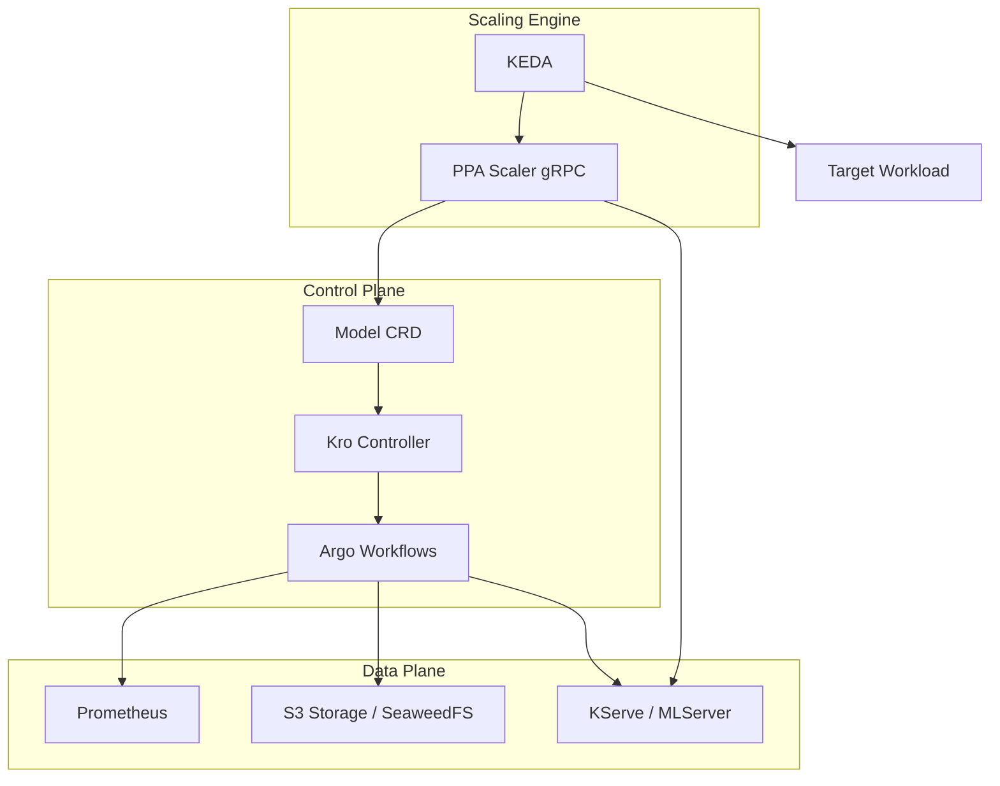

# Architecture

The Predictive Pod Autoscaler (PPA) is a modular, cloud-native system engineered to automate horizontal pod autoscaling based on intelligent time-series forecasting. It is built upon established Kubernetes ecosystems to provide a proactive scaling experience.

## System Overview

At its core, PPA shifts autoscaling from a **reactive** model (scaling after a threshold is breached) to a **proactive** model (scaling before a projected load increase).

## Core Components

### Model Custom Resource (CRD)
The `Model` resource is the primary interface for managing predictive autoscaling. PPA utilizes the [Kro](https://kro.run) controller to reconcile this resource into a fully managed lifecycle:

*   **Initial Training**: Triggers an Argo Workflow to bootstrap the first predictive model.
*   **Continuous Learning**: Manages a `CronWorkflow` for periodic model retraining.
*   **Model Serving**: Provisions a `KServe InferenceService` to expose predictions.

### PPA Scaler
A high-performance gRPC External Scaler for KEDA. It acts as the intelligent mediator between KEDA and the serving infrastructure:

*   **`IsActive`**: Prevents premature scaling actions or unnecessary cold starts.
*   **`GetMetrics`**: Dynamically requests load predictions from the served model and translates them into required replica counts.

### PPA Pipeline (Training)
A containerized Python pipeline responsible for the end-to-end machine learning lifecycle:
1.  **Data Ingestion**: Queries historical metrics from **Prometheus**.
2.  **Forecasting**: Trains time-series models using the **Prophet** algorithm.
3.  **Persistence**: Version-controls and uploads model artifacts to S3-compatible storage.

### PPA Runtime (Inference)
A custom runtime built on [MLServer](https://mlserver.readthedocs.io/). It is optimized to:
*   Load Prophet-serialized models.
*   Perform real-time inference based on a specified time "horizon" (how far into the future the system needs to forecast).

### Orchestration & Infrastructure
*   **Argo Workflows**: Provides the robust execution engine for complex training pipelines.
*   **KServe**: Manages model serving, providing production-grade features like auto-scaling for the inference server itself.
